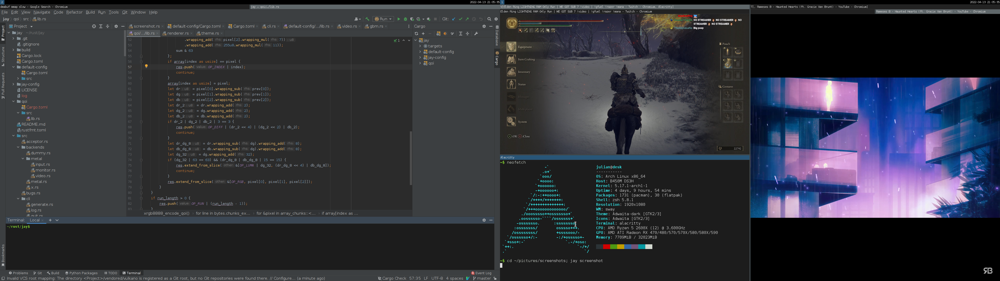

# Jay

[](http://crates.io/crates/jay-compositor)

Jay is a Wayland compositor for Linux with an i3-like tiling layout,
Vulkan and OpenGL rendering, multi-GPU support, screen sharing, and more.



## Quick Start

```shell
~$ cargo install --locked jay-compositor
~$ jay run
```

See the **[Jay Book](https://mahkoh.github.io/jay/book)** for detailed
installation instructions (including dependencies), configuration,
features, and more.

The auto-generated [Configuration Spec](./toml-spec/spec/spec.generated.md)
provides an exhaustive reference of every TOML config option.

## License

Jay is free software licensed under the GNU General Public License v3.0.

## Community

[Community Discord server (unofficial)](https://discord.gg/Hby736z28G)
